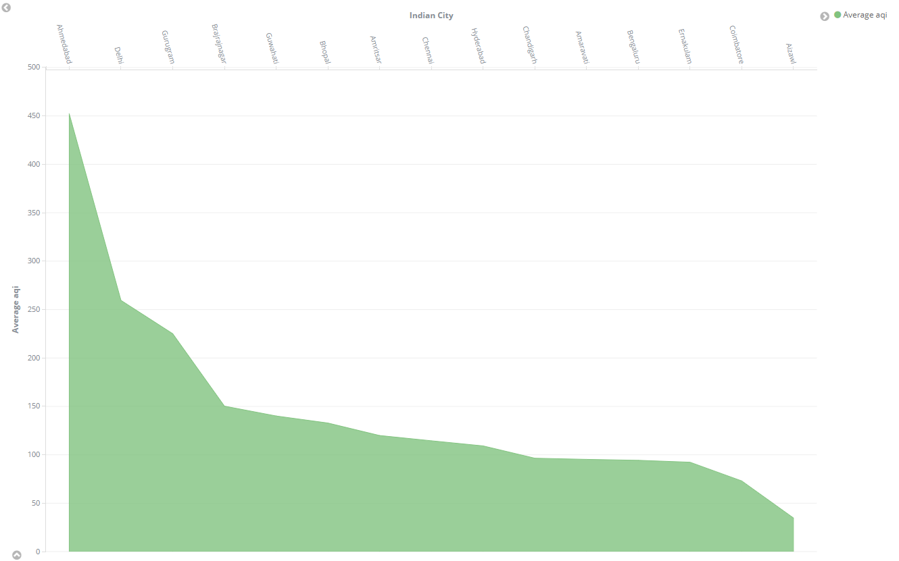
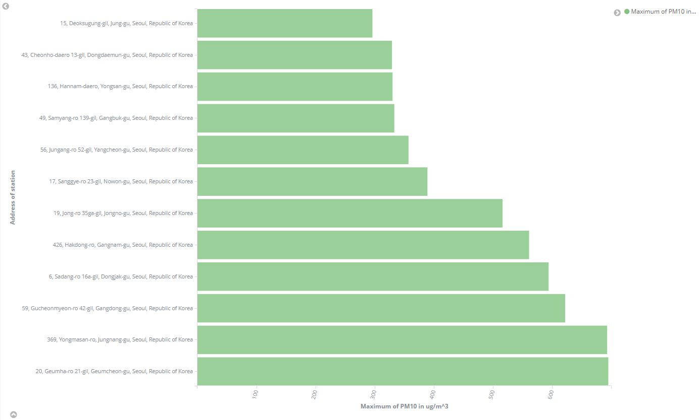
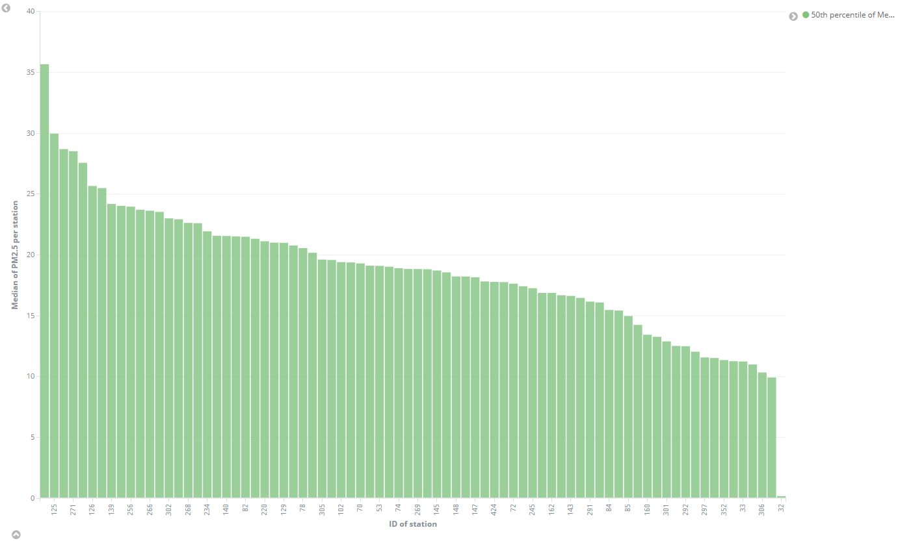
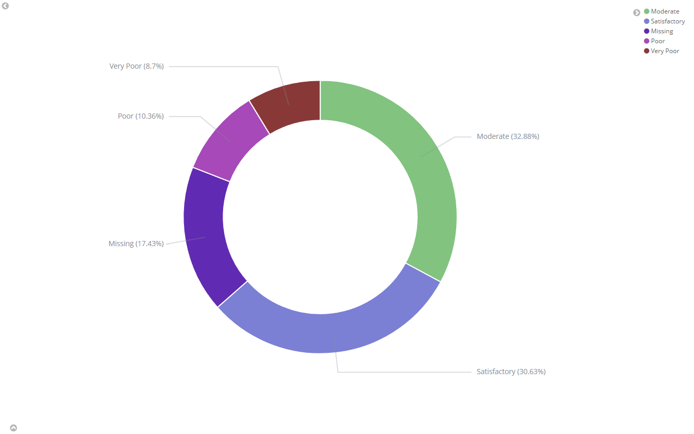
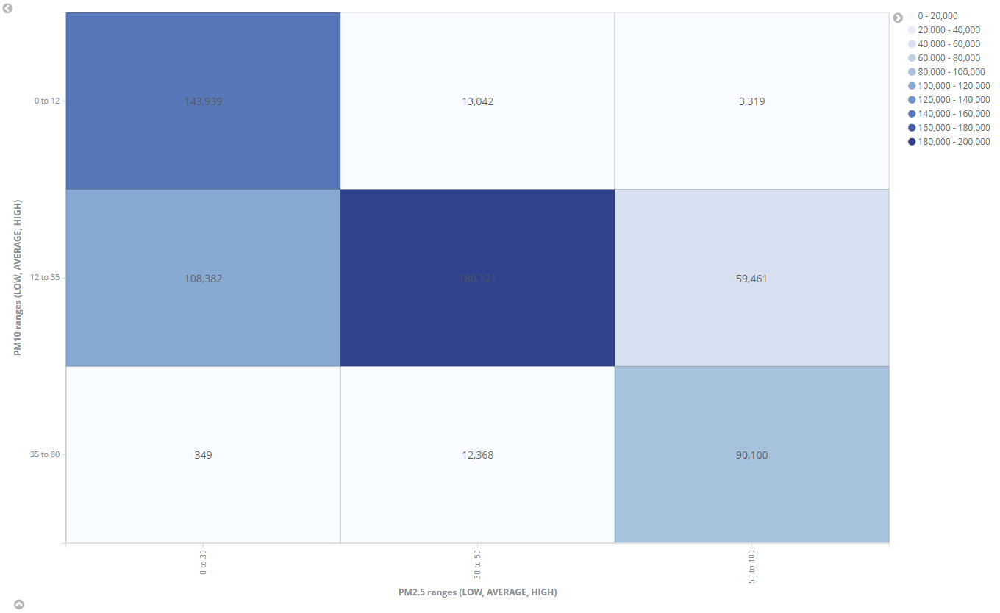
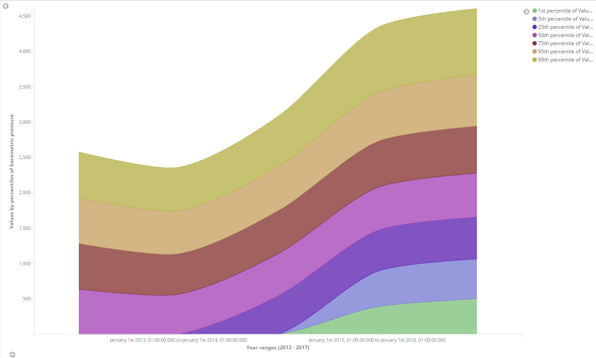
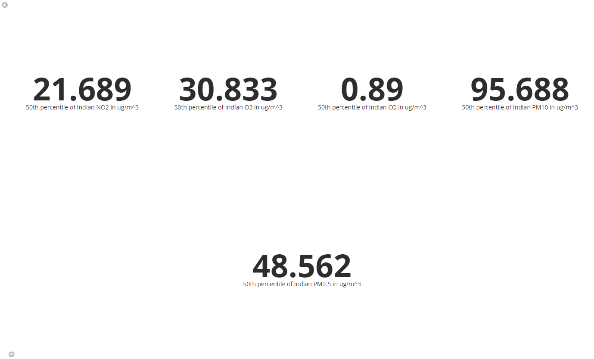
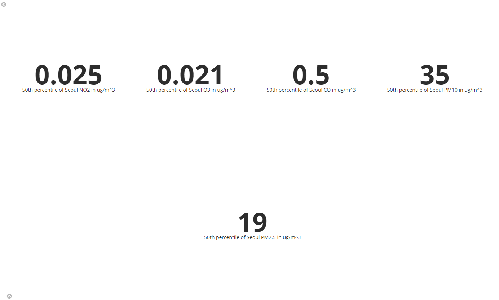
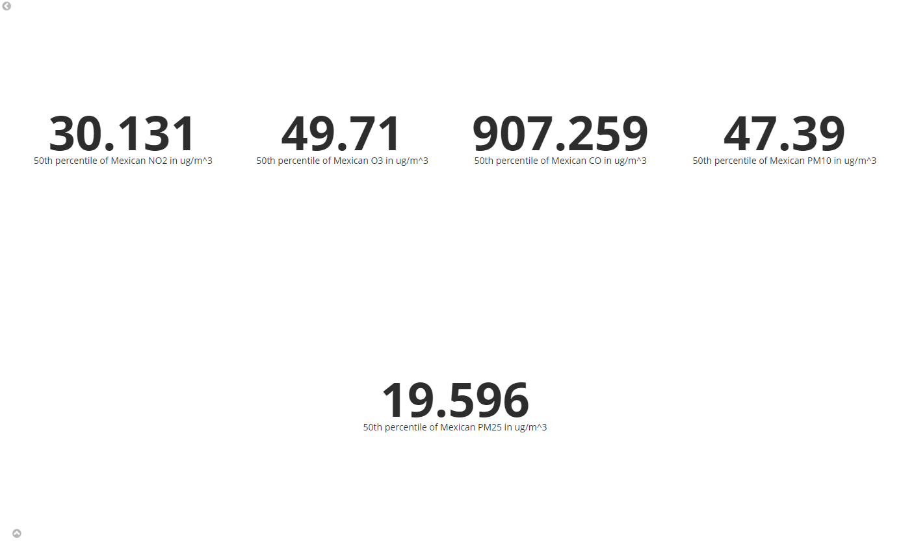

# Vizualizace dat - prezentace výsledků

## Vizualizace 1 (Area)

- Index: `india_ap`
- Osa X: 15 indických měst seřazených v sestupném pořadí podle hodnoty Y.
- Oxa Y: Index `aqi` (air quality index).
- Popis: Účelem této vizualizace je najít a ukázat 15 indických měst s nejvyšším Air Quality Index (v tomto případě čím vyšší, tím horší), z této vizualizace se dá pochopit, která indická města mají v současnosti největší problémy s kvalitou ovzduší.

## Vizualizace 2 (Horizontal Bar)

- Index: `seoul_ap`
- Osa X: Maximální hodnota hodnoty `pm10` (в $\frac{μg}{m^3}$).
- Oxa Y: 12 adres stanic (hodnota `address`).
- Popis: Význam této vizualizace je podobný předchozí, ale zde jsou obrácené osy a uvažujeme vztah pole `adresa` k poli `pm10`, abychom našli oblast Soulu s nejpříznivější (nejnižší) `pm10` hodnotou, což se může hodit například při výběru místa bydliště.

## Vizualizace 3 (Vertical Bar)

- Index: `mexico_ap`
- Osa X: Mediána hodnoty `pm25` (в $\frac{μg}{m^3}$).
- Oxa Y: Identifikační čísla stanic `station_id`.
- Popis: V tomto grafu můžeme vidět vztah mediánu hodnot `pm25` k `station_id` všech stanic z našich dat, seřazených v sestupném pořadí. Čím vyšší je tedy tato hodnota, tím horší je vliv takového vzduchu na ostatní. Díky informacím o umístění těchto stanic můžeme jasně určit, která oblast Mexika je nejšpinavější a která nejčistší (z hlediska obsahu PM2.5 ve vzduchu).

## Vizualizace 4 (Pie)

- Index: `india_ap`
- Dělené podle: `aqi_bucket` pojmů (slovní popis indexu `aqi`), včetně hodnot `missing`.
- Zaplněné podle: počtu výskytu `aqi_bucket` v indexu `india_ap`.
- Popis: Triviální graf typu `pie` ukazuje kvantitativní vztah mezi různými hodnotami `aqi_bucker` jako procento pro celý dataset, včetně hodnot `Missing`. (ty, které se rovnají `Null`).

## Vizualizace 5 (Heat Map)

- Index: `seoul_ap`
- Osa X: hodnoty indikátoru `pm25` rozdělené do 3 skupin (low, average и high).
- Osa Y: hodnoty indikátoru `pm10` rozdělené do 3 skupin (low, average и high).
- Popis: Hlavním účelem této heat mapy je sledovat vztah mezi dvěma indikátory PM2.5 a PM10. Konkrétně jejich korelace (více shod se vyskytuje na diagonálě), stejně jako odchylky vzhledem k těmto ukazatelům v ovzduší Soulu.

## Vizualizace 6 (Line)

- Index: `mexico_ap`
- Osa X: Datové roční segmenty od roku 2013 do roku 2017.
- Osa Y: Hodnota `bp` rozdělena do percentilových kategorií (1, 5, 25, 50, 75, 95, 99).
- Popis: Tento graf zobrazuje změnu statistického rozložení indexu atmosférického tlaku v Mexiku podle percentilů v průběhu čtyř let.

## Vizualizace 7, 8 a 9 (Metric)

Poslední 3 grafy jsou primitivní a typu `Metric`. Pro každý z indexů (`india_ap`, `seoul_ap` a `mexico_ap`) je jeden graf. Na každém z nich jsou triviálně vyznačeny mediány hodnot polí `no2`, `o3`, `co`, `pm10` a `pm25`. Tyto hodnoty nejsou vybrány náhodně, ale právě proto, že se v nich tyto tři datasety překrývají. Ve spodní části jsou 3 screnshoty těchto grafů.

**India:**

**Seoul:**

**Mexico:**
